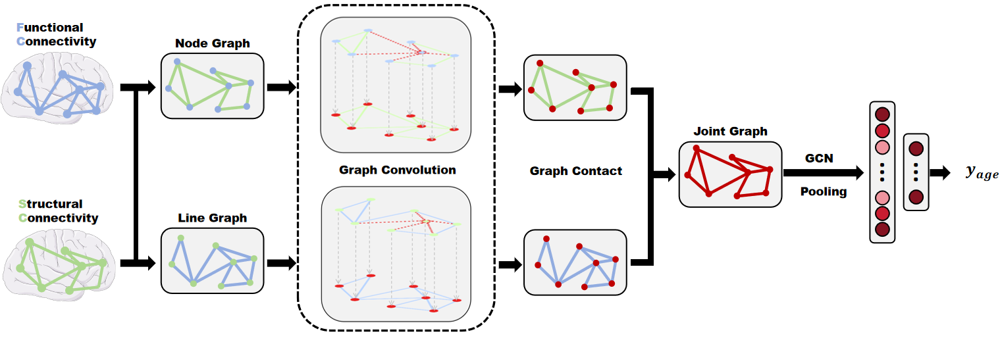

# Brain Age Prediction with Multi-Modal GCN

## Introduction
This project proposes a novel approach to brain age prediction using a Graph Convolutional Network (GCN) model. The method integrates structural connectivity (DTI) and functional connectivity (fMRI) data into a joint graph to fully utilize both node and edge information. This enables a comprehensive analysis of brain networks for age prediction.

Key aspects include:
- **Node Graph**: DTI connectivity matrix used as edges; fMRI connectivity matrix used as node features.
- **Line Graph**: fMRI connectivity matrix used as edges; DTI connectivity matrix used as node features.
- **Joint Graph**: Combines updated features from both node and line graphs.

The GCN processes the joint graph for pooling and age prediction, leveraging the complementary nature of structural and functional data.

## Dataset
The dataset consists of 196 samples from the NKI_Rockland dataset, containing both DTI and fMRI connectivity matrices. Labels include age and gender information:
- Mean age: 35 years (SD: 20 years).
- Gender ratio: 119.5 females per 100 males.

## Objectives
- Develop a GCN-based model to utilize multi-modal MRI data for accurate brain age prediction.
- Address the fusion challenge of multi-modal data to enhance interpretability and accuracy.

